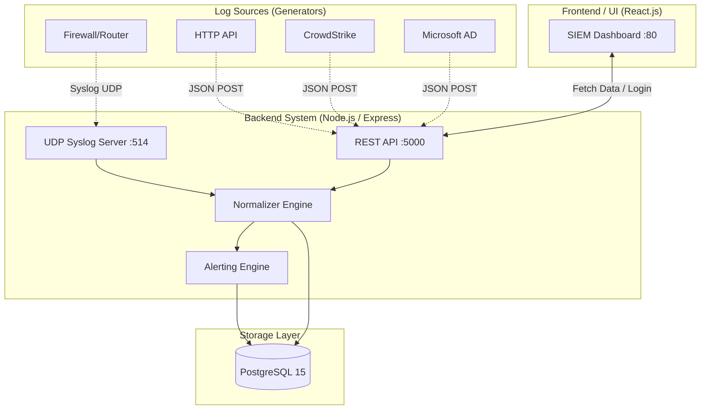

# System Architecture & Data Flow

เอกสารนี้อธิบายสถาปัตยกรรมของระบบ CyberDefense SIEM, ลำดับการไหลของข้อมูล (Data Flow) และโครงสร้างการจัดการผู้ใช้งานแบบแยกส่วน (Multi-tenant Model)

## 1. แผนภาพสถาปัตยกรรม (Architecture Diagram)

## 2. ลำดับการไหลของข้อมูล (Data Flow)
1. **Ingestion:** ข้อมูล Log ถูกส่งเข้ามาทาง HTTP (`/ingest`) หรือ Syslog UDP (Port 514)
2. **Normalization:** ข้อมูลดิบ (Raw Log) จะถูกจับคู่และแปลงให้อยู่ในรูปแบบ "Schema กลาง" (เช่น การดึง `src_ip`, `event_type`, `tenant`) เพื่อให้ง่ายต่อการค้นหา
3. **Alert Detection:** ระบบตรวจจับจะประเมิน Log ทันที หากพบเงื่อนไขที่กำหนด (เช่น ล็อกอินผิดพลาด 3 ครั้งใน 5 นาที) จะสร้างข้อมูลลงตาราง `alerts` ทันที
4. **Storage:** ข้อมูลที่ผ่านการแปลงแล้วจะถูกบันทึกลงฐานข้อมูล PostgreSQL ในตาราง `unified_logs` (โดยเก็บข้อมูลดิบสำรองไว้ในฟิลด์ประเภท JSONB)
5. **Visualization:** ฝั่ง React Frontend ร้องขอข้อมูลผ่าน REST API โดยแนบสิทธิ์การเข้าถึง (Tenant) ไปด้วย เพื่อนำมาแสดงผลเป็นกราฟและตาราง
6. **Data Retention (Housekeeping):** ระบบมี Background Process (หรือ Cron Job) คอยตรวจสอบและลบข้อมูล Log ที่มีอายุเกิน 7 วันออกจากฐานข้อมูลโดยอัตโนมัติ เพื่อบริหารจัดการพื้นที่จัดเก็บ (Disk Space Management)

## 3. รูปแบบการแยกข้อมูลลูกค้า (Tenant Model & RBAC)
ระบบใช้โมเดล **Logical Separation (Row-level Isolation)** ในการแยกข้อมูลของลูกค้าแต่ละราย:

- **Data Storage:** ทุก Log จะมีคอลัมน์ `tenant` ผูกติดอยู่เสมอ (เช่น `demo`, `demoA`, `demoB`)
- **Authentication:** เมื่อผู้ใช้งาน Login สำเร็จ จะได้รับสถานะ Role และ Tenant ประจำตัว
- **Access Control (RBAC):**
  - **Admin:** สามารถส่ง Parameter `tenant=all` ไปยัง API เพื่อดึงข้อมูลของทุก Tenant มาวิเคราะห์ภาพรวมได้
  - **Viewer (Customer):** API จะบังคับดึงข้อมูลเฉพาะ `WHERE tenant = 'ชื่อ_tenant_ของลูกค้า'` เท่านั้น ทำให้ไม่สามารถมองเห็น Log หรือ Alert ของบริษัทอื่นได้ ช่วยรักษาความลับของข้อมูล (Data Privacy) ได้อย่างสมบูรณ์แบบ